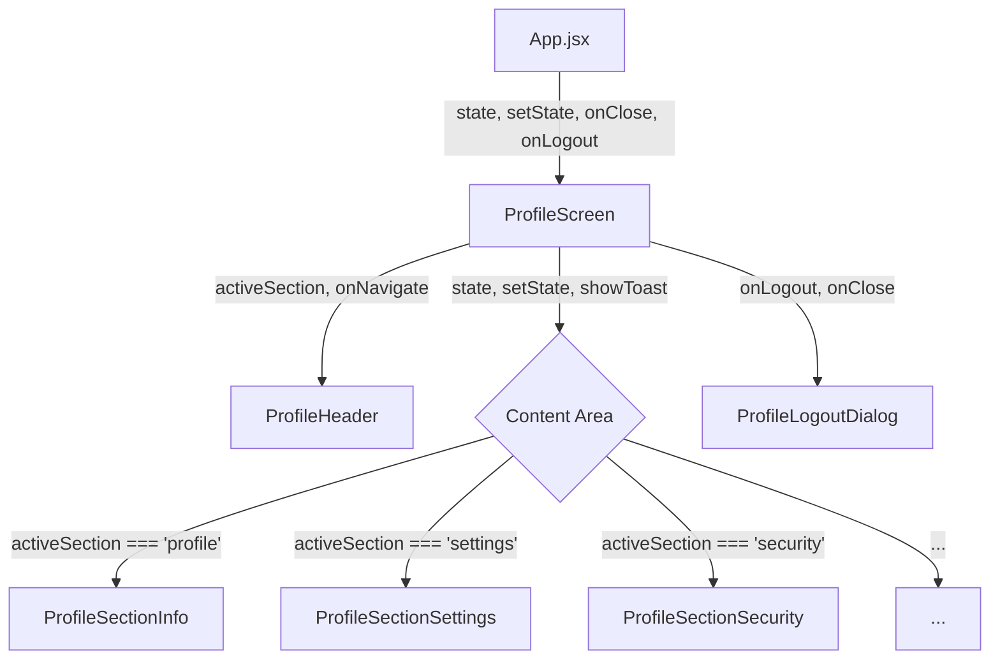

# Design: Refactor Profile Architecture

## Technical Approach

Descomponer el componente monolítico `ProfileScreen.jsx` en componentes funcionales especializados siguiendo el patrón **Container-Presentational**. El componente `ProfileScreen` mantendrá el rol de contenedor principal (orquestador de rutas internas y manejo de props globales de `App.jsx`), mientras que la lógica de renderizado de cada sección se moverá a componentes hijos dentro de una nueva carpeta `src/components/profile/`.

## Architecture Decisions

### Decision: Folder Structure for Profile Components

**Choice**: Crear `src/components/profile/` para alojar los sub-componentes.
**Alternatives considered**: Dejar todo en `src/components/` o `src/screens/`.
**Rationale**: Mantener la "Screaming Architecture" agrupando piezas que pertenecen a la misma característica funcional.

### Decision: State Isolation for Edits

**Choice**: Mover el estado `name` local a `ProfileSectionInfo`.
**Alternatives considered**: Mantenerlo en `ProfileScreen`.
**Rationale**: Evitar que cada pulsación de tecla en el nombre re-renderice todo el header y los otros sub-menus del `ProfileScreen`.

## Data Flow



## File Changes

| File | Action | Description |
|------|--------|-------------|
| `src/screens/ProfileScreen.jsx` | Modify | Se simplifica eliminando funciones inline y moviendo lógica a sub-componentes. |
| `src/components/profile/ProfileHeader.jsx` | Create | Header con título, breadcrumbs y botón volver unificado. |
| `src/components/profile/ProfileSectionInfo.jsx` | Create | Sección de edición de perfil (nombre, foto, email). |
| `src/components/profile/ProfileSectionSettings.jsx` | Create | Menú de opciones (Notifications, Security, etc). |
| `src/components/profile/ProfileSectionSecurity.jsx` | Create | Ajustes de seguridad. |
| `src/components/profile/ProfileSectionNotifs.jsx` | Create | Ajustes de notificaciones. |
| `src/components/profile/ProfileSectionExport.jsx` | Create | Lógica de exportación de datos. |
| `src/components/profile/ProfileSectionTerms.jsx` | Create | Pantalla de términos y condiciones. |
| `src/components/profile/ProfileLogoutDialog.jsx` | Create | Modal de confirmación de logout. |

## Interfaces / Contracts

### ProfileSectionInfo Props
```javascript
{
  userName: string,
  avatarUrl: string,
  onSave: (newName: string) => void,
  onAvatarChange: (file: File) => void,
  darkMode: boolean,
  onToggleDarkMode: () => void,
  onLogoutRequest: () => void
}
```

## Testing Strategy

| Layer | What to Test | Approach |
|-------|-------------|----------|
| Unit | Component isolation | Verificar que cada sección renderice su contenido esperado basado en props. |
| Manual | End-to-end flow | Probar el flujo completo de: Entrar -> Settings -> Security -> Volver -> Edit name -> Save -> Exit. |

## Migration / Rollout

No requiere migración de datos. Es un refactor puramente estructural de la UI. Se implementará de forma atómica para asegurar paridad funcional.

## Open Questions

- [ ] ¿Debemos mover la lógica de `FileReader` para el avatar a un hook personalizado o mantenerlo dentro de `ProfileSectionInfo`? (Probablemente mantenerlo por simplicidad inicial).
